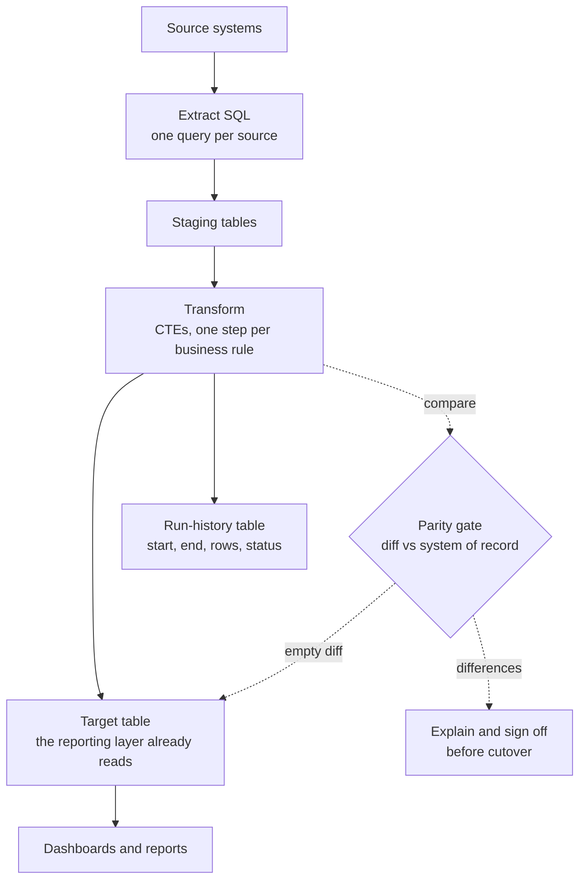

# Target Architecture and the Parity Gate

This document sketches the design a workflow moves *to*, the method that proves
the move is safe, and the observability the old tool lacked. It is generalized
and vendor-neutral.

## Dataflow

The solid path is the pipeline. The dotted path is the gate: the new output is
diffed against the legacy output, and it only reaches the target table when the
diff is empty or every remaining difference is explained and approved.

## The parity gate, concretely

Parity is a row-level comparison of the new SQL output against the current system
of record, run before cutover and again on the first live cycle.

1. Materialize the legacy output and the new output for the same window.
2. Compare on the natural key. Report three buckets: rows only in legacy, rows
   only in new, and rows in both whose measures differ.
3. A green gate is an empty diff. A difference is either a bug in the new SQL (fix
   it) or an intended improvement (make it a separate, documented change after
   cutover, never smuggled into the migration).

The discipline is: **preserve behavior first, improve second, and never in the
same step.** A migration that also "cleans things up" hides the one difference
that mattered.

## Run-history table

The visual tool ran, but a partial or failed refresh could pass unnoticed. A
small run-history table makes every refresh observable.

| Column        | Type      | Meaning                                   |
|---------------|-----------|-------------------------------------------|
| `run_id`      | integer   | Surrogate key, one per refresh            |
| `pipeline`    | text      | Which pipeline ran                        |
| `started_at`  | timestamp | Refresh start                             |
| `ended_at`    | timestamp | Refresh end                               |
| `row_count`   | integer   | Rows written to the target                |
| `status`      | text      | `success`, `failed`, or `partial`         |
| `message`     | text      | Error detail or a short note              |

Two checks sit on top of it: a **freshness** check (did the pipeline run within
its expected window) and a **volume** check (is the row count inside its normal
band). A refresh that succeeds but writes a tenth of the usual rows is a silent
failure the old tool would have missed.

## Migration sequence

1. **Inventory.** List every workflow, its inputs, its consumers, and its
   schedule.
2. **Prioritize.** Start with a pipeline that is important enough to matter and
   contained enough to finish, to prove the pattern end to end.
3. **Reverse-engineer, rebuild, gate, cut over, retire** for that one pipeline.
4. **Repeat**, folding each lesson back into a shared template so later
   migrations are faster.

## Risks and how the design answers them

- **Silent logic drift.** Answered by the parity gate: no cutover without a clean
  or explained diff.
- **Hidden dependencies.** Answered by the inventory step: consumers are mapped
  before anything changes.
- **Load failures going unnoticed.** Answered by the run-history table plus the
  freshness and volume checks.
- **Knowledge loss.** Answered by moving logic into version-controlled SQL that
  diffs and reviews like any other code.
