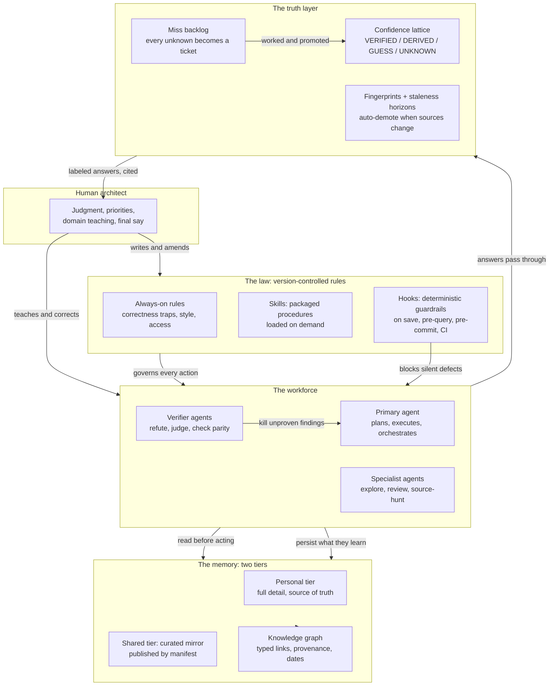

# Architecture: How the Institution Fits Together

This is the system view of the workspace described in the README. Everything
here is generalized; the pattern is what matters, not any one company's
implementation of it.

## The system

## The parts, briefly

**The human architect.** Sets direction, teaches the domain, arbitrates, and
owns the law. The system amplifies judgment; it does not replace it. Every
material change the system makes to itself is narrated, never silent.

**The law.** Rules, skills, and hooks are all version-controlled text, which
means the working agreement is reviewable, diffable, and survives any personnel
or model change. Rules are always loaded; skills load on demand; hooks are
deterministic scripts the environment enforces regardless of anyone's memory or
mood. See `examples/example_skill.md` and `examples/example_hook.md`.

**The workforce.** One primary agent orchestrates; specialist agents fan out for
search, review, and lineage-hunting; verifier agents exist to say no. The
important design choice is adversarial: a finding does not count until an
independent pass has tried to refute it, and a change to anything inherited does
not ship until it proves parity with the behavior it replaces (same inputs,
same answers, before it takes over).

**The memory.** Two tiers: a personal source-of-truth tier with full detail, and
a curated shared mirror published deliberately through a manifest (share the
source of truth; keep the scratchpad personal). Facts live in typed, dated,
provenance-carrying notes (see `examples/memory_note_template.md`), and a
periodic lint pass prunes broken links, merges duplicates, and surfaces
contradictions the way human memory consolidates rather than merely accumulates.

**The truth layer.** Every answer carries its confidence label before the answer
itself: verified against live data, derived from trusted sources with citations,
a reasoned guess with its assumption and disconfirming test stated, or an honest
unknown. Verified answers are fingerprinted against their sources and auto-demote
the moment a source changes or a staleness horizon passes. Unknowns file tickets,
and worked tickets grow the verified set: the flywheel that makes the system
smarter every week without retraining anything.

## The loops that make it compound

The boxes are static; the compounding comes from four loops that run
continuously:

1. **Work leaves residue.** Every task that touches something unprofiled
   profiles it; every durable fact learned gets ingested into the graph. The
   next session starts ahead of the last one.
2. **Mistakes become guardrails.** A defect diagnosed once is encoded as a hook
   trap or a rule, making the same silent failure structurally impossible to
   repeat.
3. **Misses become knowledge.** Questions the system cannot answer become
   tickets; worked tickets become verified answers; verified answers decay
   honestly and queue their own re-verification.
4. **The system audits itself.** On a cadence, the workspace re-scores its own
   memory maturity per lane, measures whether its confidence labels match
   empirical accuracy, and folds the findings back into the law. Metacognition,
   not just automation.

## Why it survives model change

Nothing in the diagram depends on which model executes it. The law is text, the
memory is text and structure, the truth layer is data plus checks, and the
verification discipline is procedure. Swap the model and the institution keeps
its knowledge, its standards, and its calibration. That is the design's central
bet: the durable asset is the institution, not the engine inside it.
