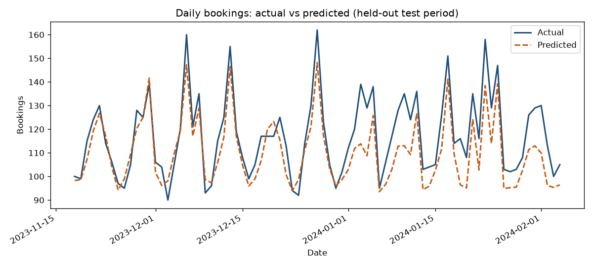

# Work Samples

Analytics engineering with SQL, Python, and machine learning, and the practice
I keep building around all of it: institutional intelligence, a governed
workspace where human judgment and AI agents compound into a shared memory, a
rulebook, and a capability that persist across sessions, people, and models.
It is a practice, not a product: never finished, always sharpening.

Every sample is stripped of company data, self-contained, and runs offline in a
couple of minutes. The aim is not perfect code. It is to show how I think
through a problem, structure a solution, and leave something a team can
actually maintain.

Contact: zachburke23@gmail.com | [LinkedIn](https://www.linkedin.com/in/zachary-burke-405135153/)

## The centerpiece

[`06_agentic_engineering`](06_agentic_engineering) describes the discipline
behind everything else here: how I engineer a human-plus-AI institution with
adversarial verification, durable institutional memory, calibrated answers,
guardrails enforced in code, an explicit governance philosophy, and
self-auditing. Projects 01 through 05 are the kind of work that system
produces; project 06 is the system itself.

## What each project shows

| Area | Project | What it demonstrates |
|------|---------|----------------------|
| Agentic engineering | [`06_agentic_engineering`](06_agentic_engineering) | The discipline: six pillars, an architecture, and generic examples of the machinery (a skill, a hook, a memory note) |
| SQL and ETL | [`01_sql_etl`](01_sql_etl) | Multi-source transformation, cross-system reconciliation, window functions, runnable against SQLite fixtures |
| Analytics automation | [`02_analytics_automation`](02_analytics_automation) | Rolling-average anomaly detection, a CLI, logging, and email alerting with credentials kept out of source |
| Machine learning | [`03_ml_forecasting`](03_ml_forecasting) | A reproducible booking forecast with time-ordered evaluation, cross-validation, and a saved chart |
| Mentorship | [`04_mentorship`](04_mentorship) | A reusable, tested data-quality toolkit and graded onboarding exercises |
| Platform migration | [`05_platform_migration`](05_platform_migration) | A generalized case study: moving pipelines off a visual ETL tool to owned SQL, proving the new version matches the old before switching (a parity gate) |

## A sample result

The forecasting project trains on the past and scores on the most recent days it
has never seen (held-out R-squared of 0.65):



## Run the samples

```bash
# Python projects
pip install -r requirements.txt

python 01_sql_etl/run_samples.py               # SQL against local fixtures, no database needed
python 02_analytics_automation/anomaly_monitor.py
python 03_ml_forecasting/booking_forecast.py    # writes the chart above
python 04_mentorship/data_quality.py
```

To run the tests and linter as CI does:

```bash
pip install -r requirements-dev.txt
ruff check .
pytest -q
```

## How this repo is built

Each project is a folder with its own README, sample data, and (where it applies)
tests. The Python samples share one `requirements.txt`, a `pytest` suite, and a CI
workflow that lints, tests, and smoke-runs every sample on each push. The point of
that scaffolding is the same as the point of the code: reproducible, reviewable
work that the next person can pick up.
